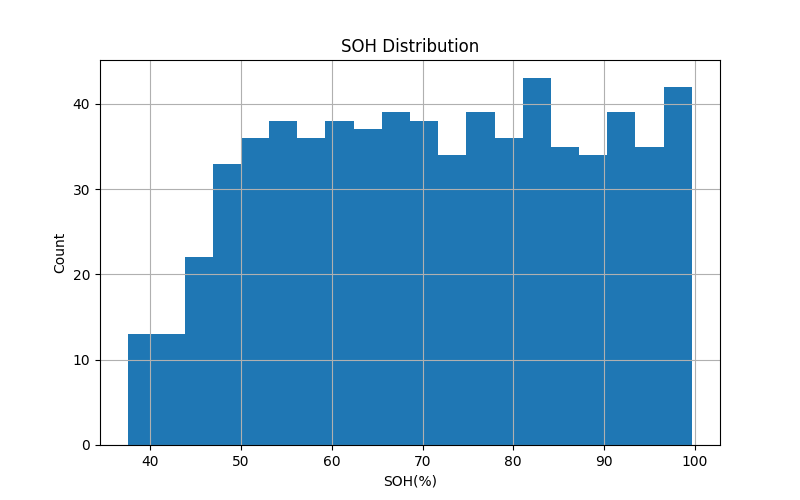
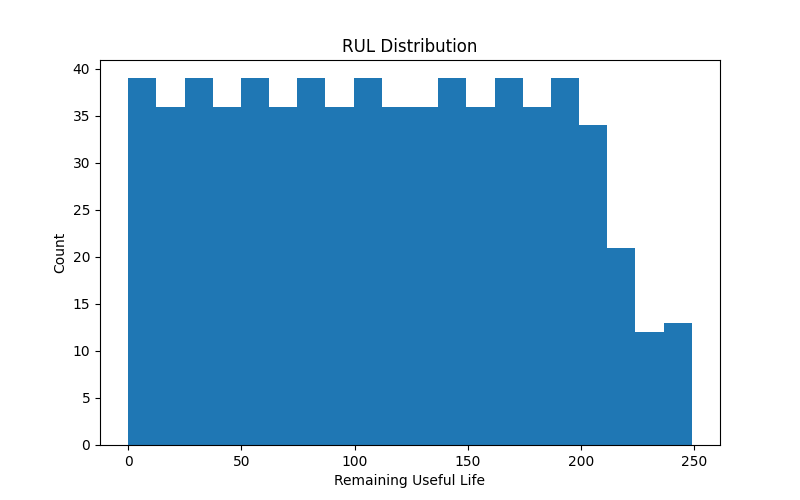
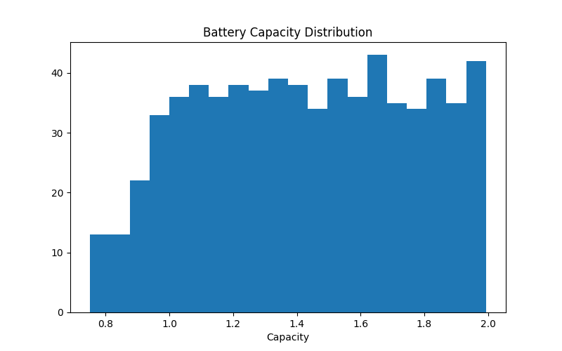
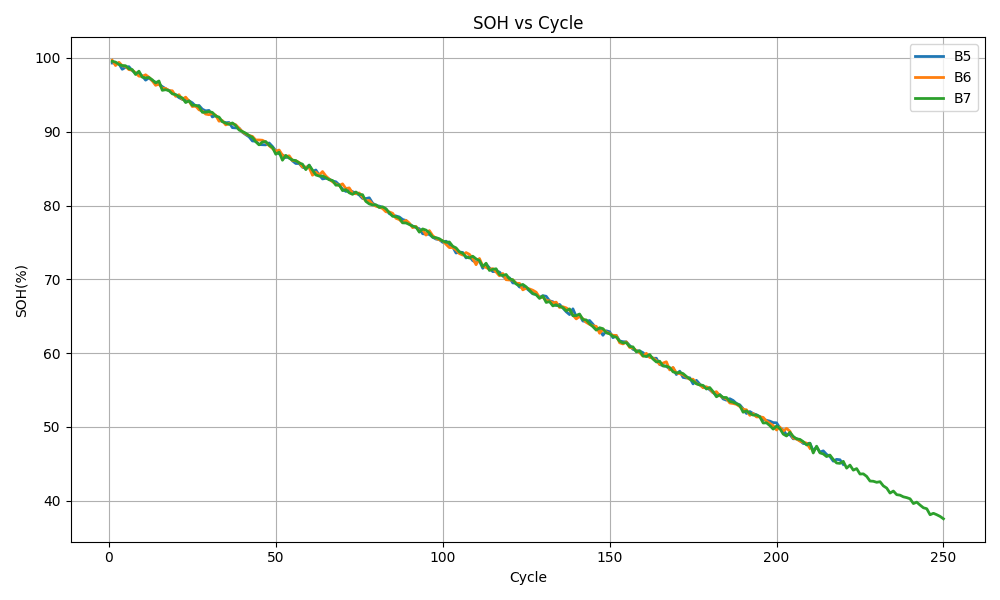
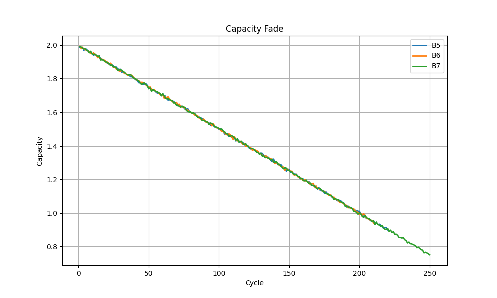
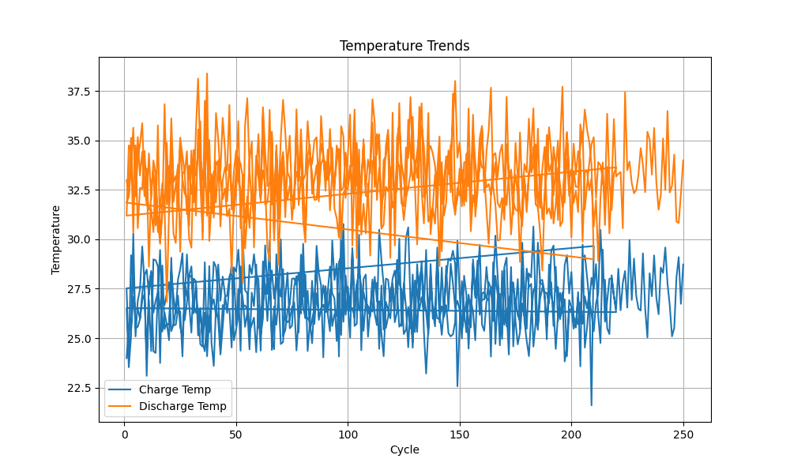
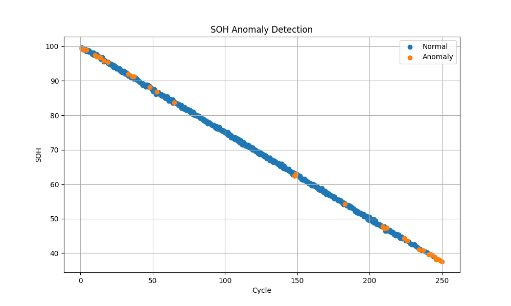
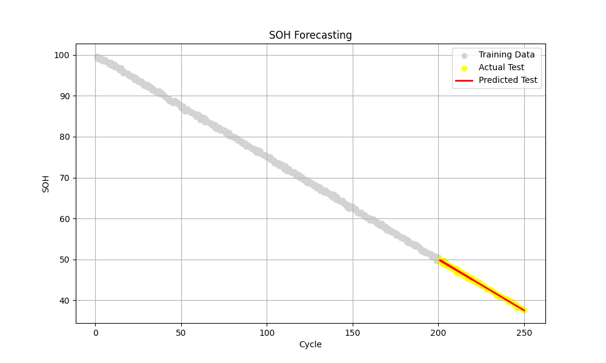

# Battery Fleet Health Monitoring and Analytics

## Project Overview

This project performs battery fleet health monitoring and analytics using operational battery data from multiple batteries. The analysis focuses on evaluating battery health, comparing battery performance, identifying abnormal behaviour, forecasting future battery health trends, and generating maintenance recommendations.

The project demonstrates battery analytics workflows commonly used in battery management systems (BMS), battery health monitoring, predictive maintenance, and energy storage applications.

---

## Dataset

The dataset contains operational battery information including:

* Battery ID
* Cycle Count
* Battery Capacity (BCt)
* State of Health (SOH)
* Remaining Useful Life (RUL)
* Temperature
* Voltage
* Current

Multiple batteries are analyzed to perform fleet-level comparisons and health assessments.

---

## Tools and Libraries

* Python
* Pandas
* Matplotlib
* Scikit-Learn

---

## Methodology

### 1. Data Quality Checks

* Load battery fleet dataset
* Check dataset structure and statistics
* Identify missing values
* Validate data quality

### 2. Fleet Summary Statistics

* Generate fleet-level battery statistics
* Compare battery performance metrics
* Evaluate overall fleet condition

### 3. SOH Analysis

* Analyze State of Health (SOH) distribution
* Evaluate fleet health condition

### 4. RUL Analysis

* Analyze Remaining Useful Life (RUL)
* Compare battery longevity across the fleet

### 5. Battery Capacity Analysis

* Compare battery capacities
* Identify performance differences between batteries

### 6. SOH Trend Analysis

* Analyze SOH degradation with cycle count
* Evaluate battery ageing behaviour

### 7. Capacity Fade Analysis

* Compare degradation patterns across batteries
* Assess long-term capacity loss

### 8. Temperature Analysis

* Compare thermal behaviour across batteries
* Evaluate temperature trends during operation

### 9. Health Classification

Batteries are classified according to SOH values:

* Healthy
* Warning
* Critical

### 10. Battery Ranking

* Rank batteries according to health performance
* Identify best and worst performing batteries

### 11. SOH Anomaly Detection

* Apply Isolation Forest anomaly detection
* Identify batteries exhibiting unusual SOH behaviour

### 12. SOH Forecasting

* Forecast future SOH trends
* Estimate battery health progression using Linear Regression

### 13. Maintenance Recommendations

Generate rule-based maintenance recommendations:

* Normal Operation
* Monitor Closely
* Inspect or Replace

### 14. Battery Health Report Generation

Export fleet health analysis results into a structured CSV report.

---

## Results

### 1. SOH Distribution

This visualization shows the distribution of State of Health (SOH) values across the battery fleet and provides an overview of overall battery condition.

---

### 2. RUL Distribution

This plot illustrates the distribution of Remaining Useful Life (RUL) values for the analyzed batteries.

---

### 3. Battery Capacity Distribution

This visualization compares battery capacities and highlights performance differences across batteries.

---

### 4. SOH vs Cycle Count

This plot illustrates how battery State of Health changes as cycle count increases.

---

### 5. Capacity Fade Comparison

Battery degradation behaviour is compared across multiple batteries using capacity fade analysis.

---

### 6. Temperature Trends

Temperature behaviour is compared across multiple batteries to identify thermal patterns and operational differences.

---

### 7. SOH Anomaly Detection

Isolation Forest is used to identify batteries with unusual SOH behaviour that may require additional monitoring.

---

### 8. SOH Forecasting

Future battery health trends are estimated using Linear Regression to support battery health assessment and maintenance planning.

---

## Output Report

The project generates a battery health report containing:

* Battery health classification
* Battery ranking
* SOH analysis
* RUL analysis
* Maintenance recommendations

Output file:

`battery_health_report.csv`

---

## Key Learning Outcomes

* Battery fleet analytics
* Battery health monitoring
* State of Health (SOH) analysis
* Remaining Useful Life (RUL) analysis
* Capacity degradation analysis
* Temperature trend analysis
* Fleet-level battery comparison
* Battery ranking and classification
* Isolation Forest anomaly detection
* Linear Regression forecasting
* Maintenance decision support
* Automated battery health reporting

---

## Files

* Battery Fleet Health Monitoring and Analytics.ipynb
* Battery Fleet Health Monitoring and Analytics.py
* Battery_dataset.csv
* battery_health_report.csv
* SOH_Distribution.png
* RUL_Distribution.png
* Battery_Capacity_Distribution.png
* SOH_vs_Cycle.png
* Capacity_Fade_Comparison.png
* Temperature_Trends.png
* SOH_Anomaly_Detection.png
* SOH_Forecasting.png

---

## Future Improvements

Possible future enhancements include:

* Real-time battery fleet monitoring dashboards
* Advanced machine learning models for SOH prediction
* Predictive maintenance frameworks
* Additional anomaly detection techniques
* Larger battery fleet datasets
* Interactive battery analytics visualization tools
* Cloud-based battery monitoring systems

---
